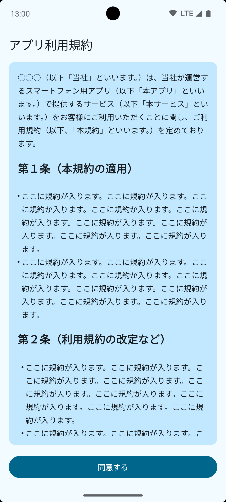

# SampleTerm

## 目的

利用規約など、一部を装飾する場合が多いテキストを都度 Spannable で装飾するのは面倒なので、テキストを [HTML](app/term.html) として保存し、それを [gradle のタスク](app/build.gradle.kts) で strings.xml として生成してアプリで利用できるようにしたもの。

> [!TIP]
> - WebView ではなくネイティブで表示しているので、簡単にライト/ダークが正しく反映される。
> - Android 特有の xml エスケープを明示的にしなくていい。

> [!WARNING]
> この repository のバージョン 1.7.6 (BOM: 2024.12.01) 時点では `<li>` や `<ol>` タグは反映されない。

## 生成タスク

```kts
// app/build.gradle.kts
// term.html を strings.xml に変換するタスクを追加
tasks.register("generateTermTaskName") {
    val stringId = "term_content"   // R.string.term_content
    val termFile = File(project.projectDir, "term.html")
    val outputDir = File(layout.buildDirectory.get().asFile, "generated/custom/res/values") // build/generated/custom/res/values/ 配下に生成

    doFirst {
        outputDir.mkdirs()

        val termHtml = termFile.readText()
        val term = termHtml
            // 改行削除
            .replace("""[\n\r]""".toRegex(), "")
            // コメント削除
            .replace("""<!--.+?-->""".toRegex(), "")
            // <body> タグ内のみ抽出
            .replace(""".*<body>(.+?)</body>.*""".toRegex(), "$1")

        val resourcesElement = Element("resources")
        val termContentElement = Element("string").setAttribute("name", stringId).setText(term)
        resourcesElement.addContent(termContentElement)

        val document = Document(resourcesElement)
        val outputter = XMLOutputter(Format.getPrettyFormat())

        File(outputDir, "strings.xml").writeText(outputter.outputString(document))
    }
}
```

## 生成したファイルをリソースファイルとして認識させる

```kts
// app/build.gradle.kts
// 生成した strings.xml を認識させる
android {
    // ...

    sourceSets {
        named("main") {
            val buildDir = layout.buildDirectory.get().asFile
            res.srcDirs(buildDir.resolve("generated/custom/res"))
        }
    }
}
```

## 生成されたもの

```xml
<?xml version="1.0" encoding="UTF-8"?>
<resources>
    <string name="term_content">&lt;p&gt;○○○（以下「当社」といいます。）は、当社が運営するスマートフォン用アプリ（以下「本アプリ」といいます。）で提供するサービス（以下「本サービス」といいます。）をお客様にご利用いただくことに関し、ご利用規約（以下、「本規約」といいます。）を定めております。&lt;/p&gt;&lt;br&gt;&lt;h2&gt;第１条（本規約の適用）&lt;/h2&gt;&lt;p&gt;1. ここに規約が入ります。ここに規約が入ります。ここに規約が入ります。ここに規約が入ります。ここに規約が入ります。ここに規約が入ります。ここに規約が入ります。ここに規約が入ります。ここに規約が入ります。&lt;/p&gt;&lt;p&gt;2. ここに規約が入ります。ここに規約が入ります。ここに規約が入ります。ここに規約が入ります。ここに規約が入ります。ここに規約が入ります。ここに規約が入ります。ここに規約が入ります。ここに規約が入ります。&lt;/p&gt;&lt;br&gt;&lt;h2&gt;第２条（利用規約の改定など）&lt;/h2&gt;&lt;p&gt;1. ここに規約が入ります。ここに規約が入ります。ここに規約が入ります。ここに規約が入ります。ここに規約が入ります。ここに規約が入ります。ここに規約が入ります。ここに規約が入ります。ここに規約が入ります。&lt;/p&gt;&lt;p&gt;2. ここに規約が入ります。ここに規約が入ります。ここに規約が入ります。ここに規約が入ります。ここに規約が入ります。ここに規約が入ります。ここに規約が入ります。ここに規約が入ります。ここに規約が入ります。&lt;/p&gt;&lt;p&gt;3. ここに規約が入ります。ここに規約が入ります。ここに規約が入ります。ここに規約が入ります。ここに規約が入ります。ここに規約が入ります。ここに規約が入ります。ここに規約が入ります。ここに規約が入ります。&lt;/p&gt;&lt;br&gt;&lt;h2&gt;第３条（本アプリの利用）&lt;/h2&gt;&lt;p&gt;1. ここに規約が入ります。ここに規約が入ります。ここに規約が入ります。ここに規約が入ります。ここに規約が入ります。ここに規約が入ります。ここに規約が入ります。ここに規約が入ります。ここに規約が入ります。&lt;/p&gt;</string>
</resources>
```

## キャプチャ

| Light                          | Dark                         |
|--------------------------------|------------------------------|
|  |  |
